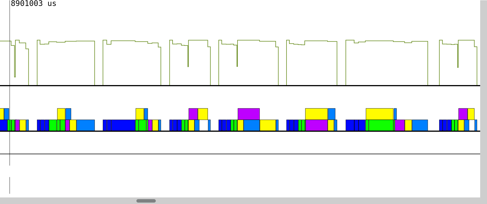
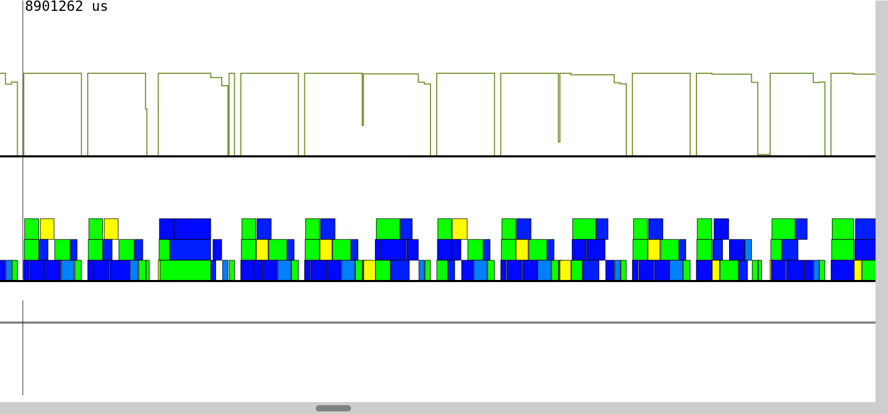
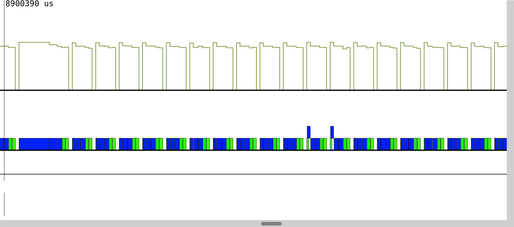

Evaluation of Legate after one month
====================================

## 1. Reproducing results of 12-step CFD
----------------------------------------

We first attempted to reproduce the throughput results from NVIDIA’s GTC presentation. By successfully reproducing the results, we would be more confident that we were correctly using Legate. A figure from the presentation shows a weak-scaling benchmark using the last step in the 12-step CFD and Legate with 1 to 2048 A100 GPUs. It evaluates the performance using the throughput – the number of grid points per second. The figure also shows the throughput of the same code using CuPy and only one A100 GPU.

Due to the limitation of the hardware resources, we tried to reproduce the throughput of one single A100 GPU rather than conduct the whole weak-scaling benchmark. However, we were not able to identify the simulation grid size from the figure in the presentation. Therefore, we ran the CFD simulation with several grid sizes and carried out a single-GPU throughput study for Legate and CuPy. While the result can reveal the throughput performance with respect to computational loading, the ultimate goal is to identify the grid size used by NVIDIA and confirm if the reproduction was successful.

The following figure shows the result of our throughput study. We calculated each data point using the mean value of 8 out of 10 identical runs. (We excluded the maximum and the minimum of the 10 identical runs.) Each run marched in time for 100 iterations with a time step size calculated from 0.95 maximum CFL number. The throughput calculation includes boundary grid points.

In NVIDIA’s figure, when using one A100, CuPy gives a throughput of about 1.66e8 points/second, and Legate gives 1.54e8 points/second. The ratio is about 1.08. From our benchmark, we were not able to obtain similar throughput values from all grid sizes. However, we obtained a throughput ratio of about 1.07 at about 1.6e8 grid points. The throughput values are 1.45e8 and 1.36e8 points/second for CuPy and Legate, respectively, at this grid size. Among all the grid sizes we tested, this grid size is also the maximum size that Legate can handle with one A100. We believe NVIDIA used a grid size close to or slightly greater than it.

Though the absolute throughput values do not match, we consider the reproduction to be successful. Many factors may contribute to the difference in the absolute throughput. For example, NVIDIA did not detail how they calculated the throughput. Did they include the boundary points? How many temporal iterations did they use? The difference in how we instrumented the code also affects the absolute values.

## 2. User experience
---------------------

### 2.1 Installation
--------------------

Legate is still a work-in-progress in its early development stage, so we think the current installation process is good enough. However, one thing we noticed is the use of hidden JSON files for recording previous installation information. For many Python users, using virtual environments (e.g., conda environments, built-in `venv`) are common. Users likely want to install Legate into several different environments. If users are unaware of the hidden JSON files, an installation of Legate in an environment may be linked to a third-party library in another environment.

### 2.2 Documentation and usage
-------------------------------

Legate requires users to launch Python programs using an executable -- `legate`. While `legate --help` shows available command-line arguments and brief explanations of the arguments, some arguments are still unclear to users, especially those who have zero knowledge of the Legion runtime system. We often have to look into the source code or go to Legion’s documentation to understand what an argument does or how to use it. An example is [issue 4](https://github.com/nv-legate/legate.core/issues/4) at the Legate Core repository. This issue clarifies the configuration of OpenMP processes, threads, CPU processes, and utility processes. We were not able to find this information in either Legate's or Legion's documentation.

On the other hand, in the same issue, developers brought out more command-line arguments from the underlying Legion runtime system: `-ll:okindhack` and `-ll:ht_sharing`. We could not find the information of these arguments in even Legion's documentation.

Another impression of Legate's usage is the command-line argument parsing system. As shown in our reply to [issue 6](https://github.com/nv-legate/legate.numpy/issues/6) at Legate NumPy repository, when mixing the arguments from Legate, Legion, and an application, the order of the arguments matters. How to determine the order, however, is unclear to users. The comments in [issue 2](https://github.com/nv-legate/legate.core/issues/2) have more discussions about Legate's argument parsing system. [Issue 3](https://github.com/nv-legate/legate.core/issues/3) and [16](https://github.com/nv-legate/legate.core/issues/16) at Legate Core and [issue 3](https://github.com/nv-legate/legate.numpy/issues/3) at Legate NumPy are other command-line argument issues we encountered during installation and using Legate.

Though most of these argument-related issues can be quickly fixed or not a current focus at the current development stage, they give an impression that Legate's argument parsing system probably still needs some improvement for average Python users to use.

### 2.3 Coding
--------------

Legate NumPy is designed to be a drop-in replacement of vanilla NumPy. However, given that it is still in an early development stage, many features are missing, and bugs exist. Currently, modifications to the application code may be necessary to bypass bugs and missing features when adopting Legate NumPy.

From a user's perspective, silent runtime failures due to bugs unknown to Legate's developers or due to insufficient defensive programming in Legate are the most frustrating. If an application has inadequate V&V, it is hard to narrow down the causes of the failures or even to know the failures' existence. Examples include issues [16](https://github.com/nv-legate/legate.numpy/issues/16), [17](https://github.com/nv-legate/legate.numpy/issues/17), and [47](https://github.com/nv-legate/legate.numpy/issues/47).

On the other hand, unimplemented features are usually fine because they throw errors and stop an application from running further. However, unclear error messages and exception types sometimes confuse us. When the crashes happen at the Legion level, the errors are also unclear for Legate's end-users. There are no Python tracebacks in these crashes. Moreover, if Legion is not built with the debug mode, the Legion-level traceback is not readable. Without a proper error message or/and an exception type, we cannot know whether an error is caused by using Legate incorrectly or is due to unimplemented features. Most of the issues we created at Legate's repositories belong to this type of problem.

## 3. Performance
-----------------

Legate currently focuses on weak-scaling performance. Though a good weak scaling does not mean it is fast, Legate's wall time performance is comparable to CuPy at least when an array is big enough, as seen in the benchmark result in section 1. The example application (i.e., the 12-step CFD) in this benchmark, however, is too simple to represent real-world applications. It is tutorial code for an entry-level class of computational fluid dynamics.

### 3.1 Memory-related issues
-----------------------------

Legate adopts Legion's task-based parallel framework. During runtime, Legate has to analyze the code on the fly to determine the coming tasks and dispatches the tasks to computing processes. It means computing tasks have to be long enough to cover code analysis and data transfer latencies. Therefore, the sizes of the arrays involved in computing tasks have to be big enough.

From the benchmark result in section 1, when the problem sizes become smaller, the gap between CuPy and Legate becomes larger. This observation proves that Legate needs arrays to be big enough to be efficient. Unfortunately, only a few GPU models have memory sizes as big as A100. If a GPU only has 16GB or even less memory, though we have not done any experiments, we suspect that Legate's performance might not be comparable to CuPy's.

In the same benchmark, only when the grid size is about 160M Legate is comparable to CuPy. Each double-precision array consumes about 1.3GB of GPU memory for the raw numeric data at this grid size. Though this usage does not seem significant, it poses a problem when running complex numerical simulations. In real-world numerical simulations, usually, we need more than one array for computing. For example, even the toy application in this benchmark requires at least 7 arrays permanently residing in memory and other temporary arrays that come and go. Another example is our Python shallow-water equation solver, [TorchSWE](https://github.com/piyueh/TorchSWE), which requires 61 permanent arrays. If an array has to be greater than 1.3GB for Legate's best performance, then no TorchSWE simulation can fit an A100 80GB GPU and be efficient at the same time.

The task-based parallelism in Legate also introduces overhead in memory usage. From the benchmark result, while CuPy can handle up to a grid size of 655M, Legate fails to do so due to out-of-memory. The memory overhead also adds difficulty for a Legate application to fit in a GPU and be efficient at the same time.

It is possible to reduce the required number of permanent and temporary arrays in application code to handle a bigger grid size with Legate and increase the efficiency. However, most Python-based numerical solvers are prototypes, proof-of-concept, or thin interfaces to some other non-Python codes. In other words, most Python numerical solvers are not optimized and will not be optimized. So as a drop-in replacement for NumPy, we believe Legate should assume application code less optimized in memory usage.

Lastly, though NVIDIA resolved the memory-leak (or says, garbage-collection) problem ([issue 33](https://github.com/nv-legate/legate.numpy/issues/33)), a memory issue regarding cuBlas is still open ([issue 36](https://github.com/nv-legate/legate.numpy/issues/36)). From our experience, however, the growth of memory due to cuBlas is relatively slow.

### 3.2 Other performance issues
--------------------------------

[Issue 29](https://github.com/nv-legate/legate.numpy/issues/29) at the Legate NumPy repository shows that checking the convergence error during a time marching loop adds a synchronization point and blocks Legate from scheduling computing tasks ahead. Checking the convergence error less frequently makes more tasks run asynchronously. Also, this strategy allows Legate to schedule more computing tasks in the future and exploit the full power of the hardware.

Figure 3.1 to figure 3.3 show the profiling results of three different versions of the Jacobi solver in [issue 29](https://github.com/nv-legate/legate.numpy/issues/29). The horizontal axis is wall time, which spans 0.5 seconds in all figures. Colored blocks are GPU computing tasks, and green curves are GPU overall utilizations. Figure 3.1 is the result of the original Jacobi solver, which calculates the convergence error every iteration and checks whether the error meets a loop-stopping criterion. The Jacobi solver for figure 3.2 still calculates the error every iteration but only checks with the loop-stopping criterion every 100 iterations. Finally, the code of figure 3.3 calculates and checks the error every 100 iterations.

All tests used a 5001x5001 grid and run for 5000 iterations. Original Jacobi solver took about 25 seconds to finish with an A100 80GB GPU. The version 1 modification (i.e., the code of figure 3.2) finished in 20 seconds, and the version 2 modification finished in about 13 seconds.

As seen in figure 3.1, the GPU was under idle state longer than the other two cases. It may indicate that checking the error with the loop-stopping criterion makes Legate's runtime analyzer unable to "see" into future iterations. It may need to perform more analysis at the end of each iteration to know what to do next on GPU, hence more GPU idle time.

Comparing figure 3.1 and 3.2 (both calculate errors every iteration), figure 3.2 shows more stacked blocks, which means more GPU tasks were able to run simultaneously to exploit the GPU's full power. Therefore, we can see more iterations in figure 3.2. In addition, the GPU's idle time is shorter.

On the other hand, in figure 3.3, the code calculates the error only every 100 iterations, hence fewer GPU tasks per iteration, and hence each iteration takes less time. Eventually, the code for figure 3.2 is much faster than the other two.

_**Figure 3.1** Profiling result of original code in issue 29 in a 0.5 second timespan_

_**Figure 3.2** Profiling result of modified code (version 1) in a 0.5 second timespan_

_**Figure 3.3** Profiling result of modified code (version 2) in a 0.5 second timespan_

[Issue 29](https://github.com/nv-legate/legate.numpy/issues/29) represents a likely issue when using Legate as a _drop-in replacement_ of NumPy in an existing Python application. As mentioned previously, most Python-based solvers are usually less optimized. Users probably will have spend some time to finally realize why their Python solvers are slow when using Legate.
