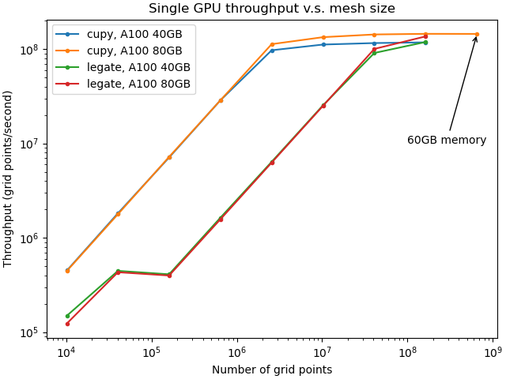

Evaluation of Legate after one month
====================================

## 1. Reproducing results of 12-step CFD
----------------------------------------

We first attempted to reproduce the throughput results from NVIDIA’s GTC presentation. By successfully reproducing the results, we would be more confident that we were correctly using Legate. A figure from the presentation shows a weak-scaling benchmark using the last step in the 12-step CFD and Legate with 1 to 2048 A100 GPUs. It evaluates the performance using the throughput – the number of grid points per second. The figure also shows the throughput of the same code using CuPy and only one A100 GPU.

Due to the limitation of the hardware resources, we tried to reproduce the throughput of one single A100 GPU rather than conduct the whole weak-scaling benchmark. However, we were not able to identify the simulation grid size from the figure in the presentation. Therefore, we ran the CFD simulation with several grid sizes and carried out a single-GPU throughput study for Legate and CuPy. While the result can reveal the throughput performance with respect to computational loading, the ultimate goal is to identify the grid size used by NVIDIA and confirm if the reproduction was successful.

The following figure shows the result of our throughput study. We calculated each data point using the mean value of 8 out of 10 identical runs. (We excluded the maximum and the minimum of the 10 identical runs.) Each run marched in time for 100 iterations with a time step size calculated from 0.95 maximum CFL number. The throughput calculation includes boundary grid points.

In NVIDIA’s figure, when using one A100, CuPy gives a throughput of about 1.66e8 points/second, and Legate gives 1.54e8 points/second. The ratio is about 1.08. From our benchmark, we were not able to obtain similar throughput values from all grid sizes. However, we obtained a throughput ratio of about 1.07 at about 1.6e8 grid points. The throughput values are 1.45e8 and 1.36e8 points/second for CuPy and Legate, respectively, at this grid size. Among all the grid sizes we tested, this grid size is also the maximum size that Legate can handle with one A100. We believe NVIDIA used a grid size close to or slightly greater than it.

Though the absolute throughput values do not match, we consider the reproduction to be successful. Many factors may contribute to the difference in the absolute throughput. For example, NVIDIA did not detail how they calculated the throughput. Did they include the boundary points? How many temporal iterations did they use? The difference in how we instrumented the code also affects the absolute values.
